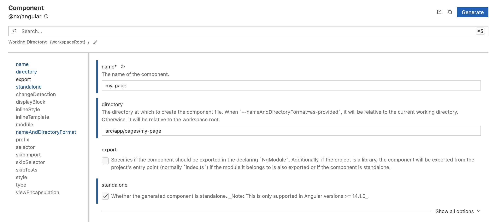

# Creating a Page

You can use Nx schematics to generate a standalone Angular component:



Alternatively, the command-line equivalent should look like the following:

```sh
npx nx generate @nx/angular:component --name=my-page --directory=src/app/pages/my-page --standalone=true --nameAndDirectoryFormat=as-provided --no-interactive


>  NX  Generating @nx/angular:component

CREATE src/app/pages/my-page/my-page.component.css
CREATE src/app/pages/my-page/my-page.component.html
CREATE src/app/pages/my-page/my-page.component.spec.ts
CREATE src/app/pages/my-page/my-page.component.ts
```

In order to be displayed, the page needs to be mapped to a route. 

## Mapping the Page to a Route

Update the `src/app/app.routes.ts` if you want to map your Page component to Route:

```ts
// ...
import { MyPageComponent } from './pages/my-page/my-page.component';

export const appRoutes: Routes = [
  // ...
  {
    path: 'my-page',
    component: MyPageComponent
  }
];
```

## Sidebar

Update the `src/app/app.sidebar.ts` file, to provide a custom Sidebar entry:

```ts
import { AppSidebarEntry } from '@app/sdk';

export const appSidebar: Array<AppSidebarEntry> = [
  // ...
  {
    text: 'My Page',
    icon: 'assignment',
    action: ['router.navigate', ['/my-page']]
  }
];
```

At the runtime, it gives the following result:


## Toolbar

Update the `src/app/app.toolbar.ts` file, to provide a custom Application Header entry:

```ts
import { AppToolbarEntry } from '@app/sdk';

export const appToolbar: Array<AppToolbarEntry> = [
  // ...
  {
    text: 'My Page',
    action: ['router.navigate', ['/my-page']]
  }
];
```

Which gives the following result at the runtime:


You can also display menu entry as an icon button:

```ts
export const appToolbar: Array<AppToolbarEntry> = [
  // ...
  {
    text: "Search",
    icon: "search",
    action: ['router.navigate', ['/search']]
  }
];
```

In this case, the `text` value becomes the button tooltip, and only icon displayed:


