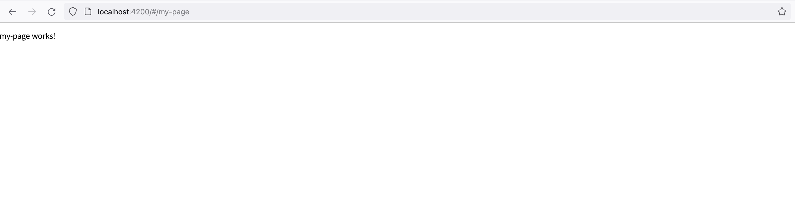

# Page Layouts

Once you click the newly introduced "My Page" link, the component is taking the whole page:



You can control if your custom page has a predefined layout, or a fully custom one.

The application comes with a set of predefined layouts:

- Blank Layout
- Standard Layout

## Blank Layout

Backed by the `BlankLayoutComponent` component, this layout provides just a main content entry on a full page.

You can use this component for cases when your page provides a fully custom content and layout,
for a single or multiple child routes.

```ts
import { BlankLayoutComponent } from '@app/sdk';

export const appRoutes: Routes = [
  // Using `Standard` layout for all child routes/components
  // ...
  
  // Using `Blank` layout for all child routes/components
  {
    path: 'pages',
    component: BlankLayoutComponent,
    children: [
      {
        path: 'page1',
        component: Page1Component
      }
    ]
  },
  {
    path: 'login',
    component: LoginComponent
  }
];
```

## Standard Layout

Backed by the `StandardLayoutComponent` component, this layout provides the following blocks:

- Application Toolbar
- Application Sidebar
- Main Content Area

In the `src/app/app.routes.ts`, make your entry a child of the route backed by the `StandardLayoutComponent`:

```ts
import { StandardLayoutComponent } from '@app/sdk';

export const appRoutes: Routes = [
  // ...
  // Using `Standard` layout for all child routes/components
  {
    path: '',
    component: StandardLayoutComponent,
    children: [
      {
        path: '',
        component: HomeComponent
      },
      {
        path: 'home',
        component: HomeComponent
      },
      {
        path: 'documents',
        component: DocumentsComponent,
        canActivate: [AuthGuardEcm]
      },
      {
        path: 'page1',
        component: Page1Component
      },
      {
        path: 'page2',
        component: Page2Component
      },
      // Move the entry here
      {
        path: 'my-page',
        component: MyPageComponent
      }
    ]
  }
  // ...
];
```

Upon navigation, the page should be looking like the following now:


