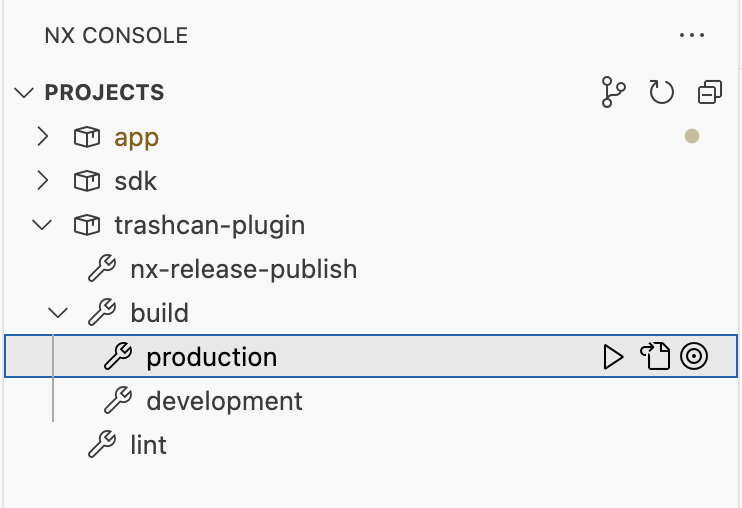

# Distributing Plugins

The plugins projects are regular Angular libraries.

As long as you generate a `buildable` library (see [Plugin Libraries](./plugins_libraries.md) chapter),
you should be able to build and publish artifacts to NPM or GitHub package registry without extra efforts.

For the sake of example, this article assumes you are building and publishing a plugin named `trashcan-plugin`.

## Updating Publish Configuration

Ensure the `package.json` config of your library contains the `publishConfig` settings as in the following example for `plugins/trashcan-plugin/package.json`:

```json
{
  "publishConfig": {
    "access": "public"
  }
}
```

## Building for Production

First, build the library for `production`.

You can do that with the Nx Console UI



Alternatively, you can build the library from the command line:

```shell
npx nx run trashcan-plugin:build --configuration=production
```

By default, the build output is placed to the `./dist/plugins/` folder.

## Publishing to NPM

At this point, you can navigate to the build output and run the `npm publish` command as in the next example:

```shell
cd ./dist/plugins/trashcan-plugin
npm publish
```
