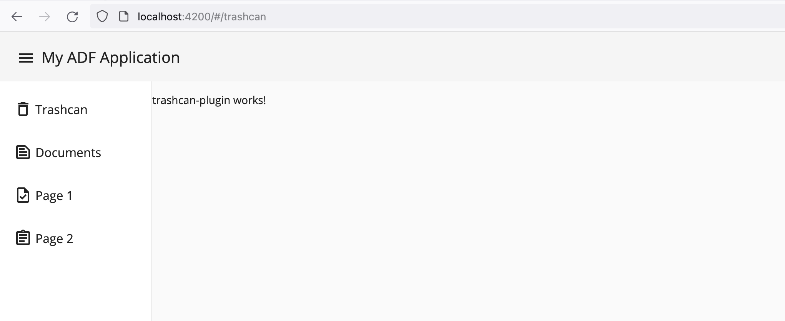
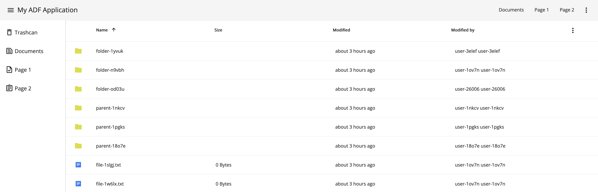

## Creating a Trashcan Plugin

In this tutorial, you are going to create a "Trashcan" page, showing deleted content in Alfresco Content Repository. The users are going to navigate to the "Trashcan" page via the Sidebar menu.

### Generating New Plugin Library

Run the following command to generate a new `trashcan-plugin` library in the workspace:

```shell
npx nx generate @nx/angular:library \
  --name=trashcan-plugin \
  --buildable=true \
  --directory=plugins/trashcan-plugin \
  --lazy=true \
  --parent=src/app/app.routes.ts \
  --routing=true \
  --projectNameAndRootFormat=as-provided \
  --skipTests=true \
  --standalone=true \
  --unitTestRunner=none \
  --no-interactive
```

> For the complete list of the supported icons, please refer to the [Google Material Icons](https://fonts.google.com/icons?icon.set=Material+Icons).

Next, update the `plugins/trashcan-plugin/src/index.ts` to export the newly created module:

```ts
export * from './lib/lib.routes';
export * from './lib/trashcan-plugin/trashcan-plugin.component';
```

### Integrating Plugin

> For the sake of the demo, we are going to keep the plugin in the same project workspace.
> In real life, however, your plugin can be coming from various sources, like NPM, tarball file, Github Package registry, etc.
>
> Please refer to [Distributing Plugins](./plugins_distributing.md) chapter for more details.

Update application routes config `src/app/app.routes.ts`, and add the `trashcan` entry to the expected position in the hierarchy:

```ts
import { trashcanPluginRoutes } from 'trashcan-plugin';

/** Global application routes */
export const appRoutes: Routes = [
  // ...
  {
    path: '',
    component: AppLayoutComponent,
    children: [
      // ...
      { path: 'trashcan', children: trashcanPluginRoutes, canActivate: [AuthGuardEcm] }
    ]
  }
];
```

Given that the Trashcan data requires authentication, you need to provide the `AuthGuardEcm` guard for your route:

```ts
{
  path: 'trashcan',
  children: trashcanPluginRoutes,
  canActivate: [AuthGuardEcm] // authentication guard
}
```

If you run the application at this point, you should see the "Trashcan" entry in the Sidebar.
The link navigates you to the main content of the plugin:



### Displaying Trashcan Content

You will need `DocumentListModule` from the Content Services, and `PaginationModule` from the Core libraries,
to display a Trashcan content with pagination support.

> See also the [DocumentList documentation](https://github.com/Alfresco/alfresco-ng2-components/blob/develop/docs/content-services/components/document-list.component.md)

In the `plugins/trashcan-plugin/src/lib/trashcan-plugin/` folder, update the component file `trashcan-plugin.component.ts`:

```ts
import { Component, ViewEncapsulation } from '@angular/core';
import { CommonModule } from '@angular/common';
import { PaginationModule } from '@alfresco/adf-core';
import { DocumentListModule } from '@alfresco/adf-content-services';

@Component({
  selector: 'lib-trashcan-plugin',
  standalone: true,
  imports: [CommonModule, DocumentListModule, PaginationModule],
  templateUrl: './trashcan-plugin.component.html',
  styleUrls: ['./trashcan-plugin.component.css'],
  encapsulation: ViewEncapsulation.None
})
export class TrashcanPluginComponent {}
```

Next, update the `trashcan-plugin.component.html` content like in the following example:

```html
<adf-document-list #documentList [currentFolderId]="'-trashcan-'" [stickyHeader]="true" [sortingMode]="'client'"></adf-document-list>
<adf-pagination [target]="documentList"></adf-pagination>
```

Points of interest:

- `currentFolderId` points to `-trashcan-`, see [Data Sources](https://github.com/Alfresco/alfresco-ng2-components/blob/develop/docs/content-services/components/document-list.component.md#data-sources) for supported keywords;
- `stickyHeader` is set to true to make the header bar remain on the screen
- `sortingMode` is set to `client` to perform fast column sorting

Finally, provide some CSS within `trashcan-plugin.component.css`, to fit the content into the page:

```css
lib-trashcan-plugin {
  display: flex;
  flex-direction: column;
  height: 100%;
}

adf-document-list {
  display: flex;
  flex-direction: column;
  height: 100%;
}
```

Now, if you run or restart the application, the "Trashcan" route requires authentication, and you are able to see deleted files and folders:



In this tutorial, you have learned how to generate a plugin library and use ADF components to render the list of deleted files and folders.
